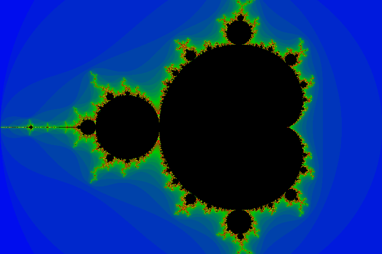

# CS 224 Assignment 1

This assignment consists of four exercises involving simple data types, printf from stdio.h, control structures and operators.

The repository contains stub source files and a makefile which sets the C version to use for compilation at "gnu11". The makefile also contains a "test" target that runs all four programs and a "clean" target that removes the executables. 

## What To Do


1. In GitLab, fork this project to make a copy under your GitLab account, it will still be called "Assign1"
2. Clone your copy of the project to your development machine.
3. Implement and test the programs.
4. ``make clean``
5. ``git add .``
6. ``git commit -m 'commit message'``
7. ``git push -u origin master``
8. Add me as a "reporter" member of you project repository.
9. Create an issue on your project repository, listing me as the assignee with a title of "Submit for grading".


## Pythagorean Triples (pythag-1.c)

Values A, B and C form a Pythagorean Triple if A<sup>2</sup> + B<sup>2</sup> = C<sup>2</sup>. Write a program to enumerate all Pythagorean Triples where A and B are both less than or equal to 60. Assume A < B (if A,B,C is a triple then so is B,A,C). Why can there be no triple where A = B? The output should look like

    $ ./pythag-1
    triple: 3 4 5
    triple: 6 8 10
    triple: 5 12 13
    triple: 9 12 15
    .
    .
    .
    triple: 25 60 65
    triple: 32 60 68
    triple: 45 60 75

There are a couple of ways to test whether a number is a perfect square. One way is to square things smaller than it to see if you ever get the number in question. The other way is to use the sqrt() function (a part of math.h) and see whether it is an integer (do this by truncating to an int and seeing if the square is the number in question). 

## Pythagorean Triple Map (pythag-2.c)

The triples enumerated in the previous program can be mapped in the plane (let A increase horizontally and B increase going down). 

    $ ./pythag-2
     123456789012345678901234567890123456789012345678901234567890
    1\
    2 \
    3  \
    4  *\
    5    \
    6     \
    7      \
    8     * \
    9        \
    0         \
    1          \
    2    *   *  \

The first line and first column are used to print single digit axis numbers. Use the same range for A and B as in the previous problem. 

## Prime Power Decomposition (ppd.c)

Write a program to compute the prime power decomposition of a positive number, other than zero or one, (the number will be fixed in the program since we have not yet dealt with input or command line arguments). For example, if the number is 1960 the output should be

```
1960 = 2 * 2 * 2 * 5 * 7 * 7
```

It will be useful to have a function for testing whether something is prime. The code for this will be similar to the code in the ptest-1 example.

Bonus points if you display the results in the form

```
1960 = 2^3 * 5 * 7^2
```

## Mandelbrot Fractal Set Image (mandel.c)

The first printed version of the Mandelbrot Fractal Set was done using a character oriented display ([here](https://commons.wikimedia.org/wiki/File:Mandel.png)). Write a program to create a similar image. 

The Mandelbrot Fractal Set is a region of the plane (-2 <= x <= 1 and -1 <= y <= 1) where a certain iterative sequence diverges in value (i.e. grows without bound). Each point in the plane is interpreted as a complex number (c = x + y i). The sequence z<sub>0</sub>, z<sub>1</sub>, z<sub>2</sub> ... is defined by

z<sub>0</sub> = (0 + 0 i)

z<sub>i+1</sub> = (z<sub>i</sub>)<sup>2</sup> + c

If this sequence ever exceeds 2 in magnitude then it must diverge. Points c, for which it does not diverge, are a part of the fractal set. 

The square of the complex number (a + b i) is ( (a<sup>2</sup> - b<sup>2</sup>) + 2 a b i ). The sum of complex numbers (a + b i) and (c + d i) is ( (a + c) + (b + d) i ). The magnitude of a complex number (a + b i) is the square root of a<sup>2</sup> + b<sup>2</sup>. 

The program will consist of two nested loops iterating y (the outer loop) from -1 to 1 and x (the inner loop) from -2 to 1. Each value of x and y represents a point c = x + y i. It may be convenient to represent z as zr and zi (the real and imaginary parts). Start z off at 0. Loop, iterating the function to get the next z value while the magnitude is less than 2 and the number of iterations is less than some limit (say 100). This is an approximation - all we know if that the series has not diverged after some number of iterations. Note: calculating the next value uses both the real and imaginary parts of the previous value and consequently these can not be changed until both have been calculated. 

If the loop completes because the iteration limit was reached, print a '*' otherwise print a ' '. Note: this is a reasonable opportunity to use the "?:" ternary operator. Alternatively, print different characters (e.g. '.', ':', '+', '#' and ' ' depending on the number of iterations before the sequence exceeded 2. This will produce a pseudo-grayscale image. 

    $ ./mandel
    ...........................::::::::::+++#:::::..............
    ........................:::::::::::++# ++:::::::............
    .....................:::::::::::::+#    #+::::::::..........
    ..................::::::::::###++ #       ##+#+++::.........
    ..............::::::::::::+++#                 #::::........
    .......::::::::++::++:::++#                    ###:::.......
    ...::::::::::::++ #   #+++                      ++::::......
    .::::::::::+#++#         #                      +:::::......
                                                  ++::::::......
    .::::::::::+#++#         #                      +:::::......
    ...::::::::::::++ #   #+++                      ++::::......
    .......::::::::++::++:::++#                    ###:::.......
    ..............::::::::::::+++#                 #::::........
    ..................::::::::::###++ #       ##+#+++::.........
    .....................:::::::::::::+#    #+::::::::..........
    ........................:::::::::::++# ++:::::::............
    ...........................::::::::::+++#:::::..............

If instead of using printable characters you instead write triples of unsigned char (e.g. 0 - 255) as red/green/blue values for each pixel the program will produce raw image data which can be converted into a png or tiff file using a utility such as "convert" (from the ImageMagick package). This results in




