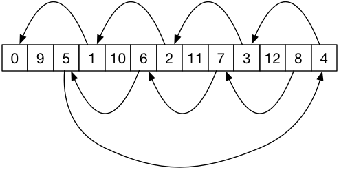
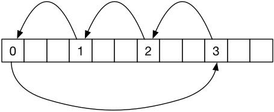

# CS 224 Assignment 2

This assignment consists of two exercises involving character I/O, functions and arrays. This repository contains stub files for the assignments, a data file for testing and a makefile with build and test targets. 

## Character Histogram

Write a program to count the number of occurences of each alpahbetic letter (case insensitive) in the stdin input stream and display a histogram of the results in the following form. 

    $ ./ch < MobyDick
            1                                           
    5   1 2 0 2 2 5 8     4 3 6 6 2   5 5 7 2 1 1   2   
    7 9 8 1 7 2 4 1 0 0 4 5 0 2 2 5 2 6 3 6 6 3 7 0 2 2 
    A B C D E F G H I J K L M N O P Q R S T U V W X Y Z 

The counts of each character are displayed vertically starting with the most significant digit. You may use stdio.h and ctype.h. You may NOT use the functions in math.h. You will want to implement functions

```
int  digitCnt(int val)               // gives the number of digits in val
                                     // e.g. digitCnt(425) returns 3
char digitAtPosition(int val, int i) // return the ith digit of val as a char
									 // e.g. digitAtPosition(425,1) is '2'
```

The program should work for all counts within the range of an int. 
 

## Rotate Interior Letters of a Word

Write a program that reads the stdin stream looking for words (consecutive alphabetic characters) and for each word left rotates the interior letters (i.e. excludes the first and last) by half the length of the interior sequence printing the result to the output. For example, "tweleve" has 7 letters and the interior is "welev" which has 5 letters. Rotating the interior by 2 gives "levwe". So "tlevwee" is printed in place of "tweleve". All other characters are written to stdout unchanged. 

This is a variation on the "scramble" idea that swaps the interior letters of a word showing that the brain is very adaptable in reading words.

Rotation of a sequence should be done in-place (i.e. without using an extra workspace array). This means that we want to read and buffer all of the characters of a word prior to operating on it.

In place left rotation can be accomplished by picking up the first letter and replacing it by the letter offset from it by the rotation amount. For example, a sequence of 13 letters, rotated by 3 can be done with



Depending on the length and the rotation amount this may not end up moving all characters. For example, with 12 letters, rotation by 3 would give the moves



In this case the moves to not reach all characters. In this case begin again with the second letter of the word. Hint: the GCD of the length and rotation amount help you distinguish these cases. 

You will want a function

```
void rotate(char * buf, int len, int cnt)
```

You may use stdio.h, ctype.h and strlen() from string.h but nothing else. You may also use the gcd function from the in class example. 

	$ ./rotword < MobyDick
	Clal me Imaeshl. Smoe yares ago- nveer mnid how lnog piselrecy- hinavg ltlite
	or no mneoy in my prsue, and nhinotg pculaartir to iresntet me on sorhe, I
	tughhot I wulod sial aoubt a ltlite and see the weraty prat of the wrlod. It
	.
   	.
   	.

## What To Do

- Fork this repository in GitLab
- Clone your fork to your development machine.
- Implement the assignment. 
- "make clean" and then "git add/commit/push" back to GitLab.
- Add me as a reporter member of your repository.
- Create an issue with me as the assignee. Use the issue title "Assign2 Ready for Grading"."
- In the issue make a note of your difficulty factor estimate for this assignment relative to the first assignment. 

