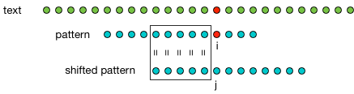

# CS 224 Assignment 3

This assignment consists of two exercises involving command line arguments and global variables. This repository contains stub files for the assignments, a data file for testing and a makefile with build and test targets. 

## Binary Data Dump

Write a od (octal dump) like utility. It should accept the following command line options.

    -x     -- display data in hexidecimal
    -o     -- display data in octal
    -d     -- display data in decimal
    -a     -- if a byte is a printable character print it instead (g = 1)
    -g arg -- display bytes in groups of arg = 1 (default), 2 or 4
    -s arg -- skip arg bytes before starting display (default 0)
    -l arg -- display at most arg bytes (default 256, multiple of g)
    -w arg -- display arg bytes per line (default 32, multiple of g)
    
The program should consist of the following

__main function__

* process argc/argv using getopt(), you should have global variables for the option values
* verify that the options are consistent and satisfy the required constraints)
* call readInput() to process input

__readInput function__

* read characters one at a time using getchar(), place into buffer of group size (1, 2 or 4)
* when buffer complete, call displayBuffer()
* check skip count and display length count
* write line header
* write newline at end of line

__displayBuffer function__

* given buffer or 1, 2 or 4 characters display according to the selected options
* treat characters, shorts and ints as unsigned to avoid negative display problems
* format tags are %x, %o and %u for unsigned hex, octal and decimal
* include character count in format tags to keep display aligned (e.g. %02x for hex byte, %04x for hex short and %08x for hex int
* multiple bytes can be formed into a short or int using the bit shift operator and addition (e.g. (buf[1] << 8) + buf[0])

You may use stdio.h, ctype.h for isprint(), unistd.h for getopt(), stdlib.h for strtol() (safer than atoi()) and limits.h for INT_MAX.

    $ ./od -x -a < bin-data
          0 -- cf fa ed fe 07 00 00 01 03 00 00 80 02 00 00 00 0f 00 00 00  P 05 00 00 85 00    00 00 00 00 00 
         32 -- 19 00 00 00  H 00 00 00  _  _  P  A  G  E  Z  E  R  O 00 00 00 00 00 00 00 00 00 00 00 00 00 00 
         64 -- 00 00 00 00 01 00 00 00 00 00 00 00 00 00 00 00 00 00 00 00 00 00 00 00 00 00 00 00 00 00 00 00 
         96 -- 00 00 00 00 00 00 00 00 19 00 00 00  ( 02 00 00  _  _  T  E  X  T 00 00 00 00 00 00 00 00 00 00 
        128 -- 00 00 00 00 01 00 00 00 00 10 00 00 00 00 00 00 00 00 00 00 00 00 00 00 00 10 00 00 00 00 00 00 
        160 -- 07 00 00 00 05 00 00 00 06 00 00 00 00 00 00 00  _  _  t  e  x  t 00 00 00 00 00 00 00 00 00 00 
        192 --  _  _  T  E  X  T 00 00 00 00 00 00 00 00 00 00  p 0d 00 00 01 00 00 00 b8 01 00 00 00 00 00 00 
        224 --  p 0d 00 00 04 00 00 00 00 00 00 00 00 00 00 00 00 04 00 80 00 00 00 00 00 00 00 00 00 00 00 00 
        
==

    $ ./od -o -g 2 -l 64 <bin-data
          0 -- 175317 177355 000007 000400 000003 100000 000002 000000 000017 000000 002520 000000 000205 000040 000000 000000 
         32 -- 000031 000000 000110 000000 057537 040520 042507 042532 047522 000000 000000 000000 000000 000000 000000 000000 

==

    $ ./od -d -g 4 -l 64 <bin-data
          0 -- 4277009103 0016777223 2147483651 0000000002 0000000015 0000001360 0002097285 0000000000 
         32 -- 0000000025 0000000072 1095786335 1163543879 0000020306 0000000000 0000000000 0000000000 

## Sequence Matching

Given a long sequence of characters (the text) and a short sequence (the pattern), a naive method for searching for the pattern in the text is to compare the pattern against the text at each location within the text. In the worst case this might involve length(text)*length(pattern) comparisons. It also requires that length(pattern)-1 characters of the text be buffered since on match success or failure comparison with the pattern needs to restart at the next text position. 

We want a text/pattern matching program that does not require buffering of text characters (i.e. at every point in time we only have a single character of the text). This is accomplished by exploiting structure in the pattern string. 

Suppose that we have successfully matched the pattern against a portion of the text but the match fails at index i in the pattern (red circles). We cannot back up in the text (it is not buffered) but we know that everything up to position i in the pattern has matched the text. We want to find a position j within the pattern such that the sequence up to j is the longest prefix of the pattern which is a suffix of the portion of the pattern which has already matched the text. We resume comparison at position j within the pattern. 

This structure of the pattern is independent of the text and can be precomputed. Specifically, we want to compute an array shift[i] = j such that pattern[0] ... pattern[j-1] is the longest prefix which is a suffix of pattern[0] ... pattern[i-1]. With this information we can read the text one character at a time and compare it against the pattern. If the characters match we read another character and advance the position within the pattern, if they don't match we use the shift table to backup the position within the pattern and recompare (this may result in eventually backing up to the beginning of the pattern). If we reach the end of the pattern then we have found a match. 

Write a program which takes a single command line argument consisting of the pattern string and reads the text from stdin using getchar(). It reports the locations in the text at which the pattern was found. Note: it is easier to say where the end of the pattern match occurs than to say where the beginning of the match occurs. We will use DNA sequence data as the test data. The program should consist of the following 

__main function__

* compute the shift array by finding for each position i in the pattern, the largest j such that pattern[0] ... pattern[j-1] is a suffix of pattern[0] ... pattern\[i-1\] (use the prefixSuffix() utility function describe below to check this property)
* display the pattern and shift data for verification
* perform the text to pattern comparison loop using the algorithm described above

__nextchar() function__

* instead of calling getchar() in the comparison loop create and call a nextchar() function
* the DNA data is formated 70 characters per line, nextchar() calls getchar() to get the next character but filters out newline characters
* nextchar() should also keep track of the current line and column number to use in indicating where matches occur

__prefixSuffix function__

* this function takes three arguments: a pointer to the pattern string, a prefix length (j) and a string length (i)
* it determines whether pattern[0] ... pattern[j-1] is a suffix of pattern[0] ... pattern[i-1] 
 
There are several pieces of data (e.g. current line and column) that work well as global variables. You may use stdio.h and strlen() from string.h.

    $ ./match AAGAGAAGAAAC < DNA-22
      0  1  2  3  4  5  6  7  8  9 10 11 12
      A  A  G  A  G  A  A  G  A  A  A  C
      0  0  1  0  1  0  1  2  3  4  2  2  0
    found at line: 472 col: 14
    found at line: 16652 col: 26
    found at line: 95359 col: 16
    found at line: 96508 col: 41
    found at line: 136171 col: 50
    found at line: 139430 col: 9
    found at line: 155824 col: 23
    found at line: 167247 col: 13
    found at line: 209961 col: 4
    found at line: 324799 col: 7
    found at line: 345370 col: 27
    found at line: 346996 col: 48
    found at line: 347001 col: 66
    found at line: 401031 col: 14
    found at line: 462745 col: 7
    found at line: 491602 col: 51
    read: 35152671 cmp: 43543583 ratio 1.238699

## What To Do

- Fork this repository in GitLab
- Clone your fork to your development machine.
- Implement the assignment. 
- "make clean" and then "git add/commit/push" back to GitLab.
- Add me as a reporter member of your repository.
- Create an issue with me as the assignee. Use the issue title "Assign3 Ready for Grading"."
- In the issue make a note of your difficulty factor estimate for this assignment relative to the first assignment. 

