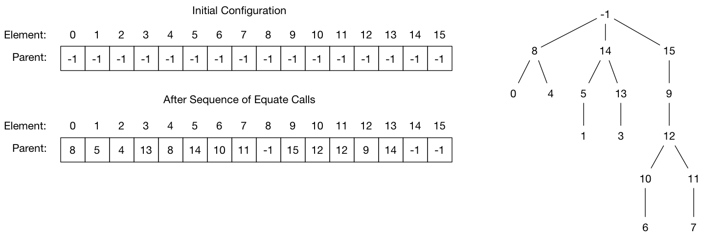

# CS 224 Assignment 4

### Equivalence Relations

Equivalence relations (remember CS 225) are relations that satisfy the properties of reflexivity (everything is related to itself), symmetery (if A is related to B then B is related to A) and transitivity (if A is related to B and B is related to C then A is related to C). When you have an equivalence relation you also have equivalence classes - that is the groups of things that are related to each other. 

For example, define a relation so that two persons are related if they have birthdays in the same month. This is reflexive (a persons birthday is in the same month as that person), symmetric (if persons A's birthday is in the same month as person B's, then B's birthday is in the same month as A's) and transitive (if A's is in the same month as B's and B's is in the same month as C's then A's is in the same month as C's). 

For each month there is a class (or group) of all the people whose birthday is in that month. Knowing the equivalence classes of a relation helps solve a number of problems. 

### The Assignment

In this assignment you will implement a data type and functions for calculating and working with equivalence classes. This implementation will then be used in two different applications. 

### The Data Type and Functions

The file ``ec.h`` opaquely defines an equivalence class data type and an API of functions. The implementation of the type will be a struct containing a size field and a data field pointing to an integer array. The elements of the relation will be integers. The array size will equal the numbers of elements being considered. The contents of the array will encode by assigning to each element a parent. Initially, the parent of every element will be ``-1`` indicating no parent. As pairs of elements are equated the parent value of one of the elements will be set to the other element. The chain of parents will eventually lead to an element with parent ``-1``. These elements will be taken as the representative, or root, element of the corresponding class. Two elements will be related if they lead to the same root. The following diagram illustrates this for a simple case. 



The API for the data type consists of


``EC *  makeEC(unsigned int size);              // allocate, initialize and return an EC instance``

``void  freeEC(EC * ec);                        // free an EC instance``

``int   classRepFor(EC * ec, unsigned int elt); // return the class representative for elt``

``                                              // i.e. follow parent chain to -1 element``

``void  equate(EC * ec, int a, int b);          // equate the two elements``

``int * classReps(EC * ec);                     // allocate and return a -1 terminated array ``

``                                              // of integers holding the class representatives``

``int   classCount(EC * ec);                    // return the number of class groups ``

``													  // i.e. the number of elements with -1 as parent``

``int * classOf(EC * ec,unsigned int elt);      // allocate and return a -1 terminated array``

``                                              // of all elements equivalent to elt``

``void  displayData(EC * ec);                   // write the data contents to stdout``


The program ``ec-test.c`` provides a test of the EC implementation. Its output will be 

```
./ec-test
#classes = 3
class of 8: 0 2 4 8 
class of 14: 1 3 5 13 14 
class of 15: 6 7 9 10 11 12 15 
---
index   0  1  2  3  4  5  6  7  8  9 10 11 12 13 14 15 
parent  8  5  4 13  8 14 10 11 -1 15 12 12  9 14 -1 -1 

```

### Application to Connection Components in an Image

One application of equivalence classes is finding the connected components of an image. For example, the following array of characters can be divided into regions consisting of the same character which are connected by adjacency. There are 7 regions because the ``+`` characters exist in 3 disconnected regions. 

```
aaaaaaaaaaaaaaa
a..++++aaa++++a
aa...+++aaa++aa
a..+++++aa++..a
a..+++++++++..a
a...+++++++...a
a...''==='++..a
a..''===''++..a
a..''===''''..a
a...''''''....a
a.....''''....a
a++........++aa
aa++++....+++aa
aa++...aa..++aa
aaaaaaaaaaaaaaa
```

The file ``concomp.c`` contains the outline of an implementation. The input is read from a file of characters into an internal buffer. The file of characters must form a square grid. 

### Application to Matching DNA Sequences

When DNA is sequenced it is broken up into a large number of relatively short segments. Each segment is then sequenced. Since the sample will always contain many copies of the DNA the result is a large collection of mutually overlapping sequences. The entire DNA sequence can then be reconstructed by finding how the collection of short segments overlap to form the whole. 

The file ``shotgun.c`` contains most of an implementation that given a collection of short sequences determines the number, and members, of equivalence classes under the relation of overlap. You need to complete the implementation of the ``overlap(char * a, char * b)`` function which tests whether a sequence ``a`` overlaps a sequence ``b``. This amounts to two nested loops. The outside loops tries all possible relative positions of the two sequences. The inside loop compares characters of ``a`` to characters of ``b``. The following diagram shows two ways in which an overlap may occur.

```
match   CCCTACTAAAATACAAA
            ACTAAAATACAAAAATT

match         AATTAGCCCAGCTTGGTGGT
        TACAAAAATTAGCCCAGCTT
```

In the first sequence ``a`` preceeds ``b``. In the second ``b`` preceeds ``a``. This symmetry can be handled by considering the position of the start of ``b`` relative to ``a``. In the first case ``b`` has a positive shift of 5 characters. In the second case ``b`` has a negative shift of 7 characters. The outer loop considers all possible shift positions. We require a minimum overlap that is half the size plus one of the shortest string. For this range of possible shifts the inner loop compares the appropriate range of characters between ``a`` and ``b``. 

The result of the program is the number of classes and the sequences that belong to each class. 


## What To Do

- Fork this repository in GitLab
- Clone your fork to your development machine.
- Implement the assignment. 
- "make clean" and then "git add/commit/push" back to GitLab.
- Add me as a reporter member of your repository.
- Create an issue with me as the assignee. Use the issue title "Assign3 Ready for Grading"."
- In the issue make a note of your difficulty factor estimate for this assignment relative to the first assignment. 

