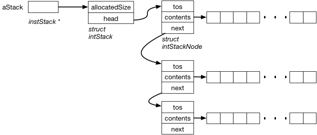

# CS 224 Assignment 5

## Linked List Implementation of intStack

In class we looked at an opaque intStack type and an implementation of the interface (intstack.h) that used an array of integers and realloc() to grow in size when necessary.

For this assignment you will provide an alternate implementation of the interface that uses a singly linked list of fixed size stack nodes. When the stack of one node reaches capacity a new stack node is created and added to the head of the list.

The repository contains

* intstk.h    - the interface (typedef and functions) for the integer stack
* intstk-r.c  - the realloc based implementation
* intstk-l.c  - the linked list implementation with stub functions
* stksort.c   - a driver that uses two stacks to sort an input stream of characters
* expreval.c  - a driver that implements infix expression evaluation
* DonQuixote  - test file for stksort.c
* expr-test   - test data for expreval.c

The implementation defines a __struct intStack__ with fields __allocatedSize__ and __head__. The __head__ will be a pointer to a __struct intStackNode__ which will have fields for the top of stack index (this is always the next available slot), the contents array and the next node in the list. The contents array of each node will all be a fixed size as specified in the stack creation call. The functions need to do the following

* __makeNewNode()__ - This is not in the interface but is a convenient function to have. It allocates a __struct intStackNode__, initializes the fields, allocates and assigns storage for the contents arrays and returns the node.
* __stkCreate()__ - Allocate a __struct intStack__ and initialize the fields. It creates an initial __struct intStackNode__ to be the stack head. 
* __stkEmpty()__ - Returns whether or not the stack is currently empty. A stack is empty if the head node top of stack is zero and there are no other nodes. 
* __stkPush()__ - Pushes the given value onto the given stack. If the head stack node is currently full a new node is created and inserted at the head of the list before pushing the new value.
* __stkPop()__ - Pop and return the top value from the stack. If the stack is empty it returns the NUL character. If the head stack node is currently empty it is removed from the list and freed before returning the top value.
* __stkTop()__ - Return the top value from the stack without poping. If the stack is empty it returns the NUL character. If the head stack node is currently empty then the top character of the next node is returned. 
* __stkReset()__ - Return the stack to it initial condition by freeing all stack nodes other than the head node and setting the top of stack to zero. 
 
There are choices to make regarding when new nodes are added and removed and the above descriptions assume a particular choice. There are alternatives. 

The makefile includes targets to build both stksort and expreval with either implementation of intStack ("make stksort-r", "make stksort-l", "make expreval-r", "make expreval-l"). They can be tested with
 
		./stksort-l <DonQuixote
		./expreval-l <expr-test
 
## What To Do

- Fork this repository in GitLab
- Clone your fork to your development machine.
- Implement the assignment. 
- "make clean" and then "git add/commit/push" back to GitLab.
- Add me as a reporter member of your repository.
- Create an issue with me as the assignee. Use the issue title "Assign5 Ready for Grading"."
- In the issue make a note of your difficulty factor estimate for this assignment relative to the first assignment. 

