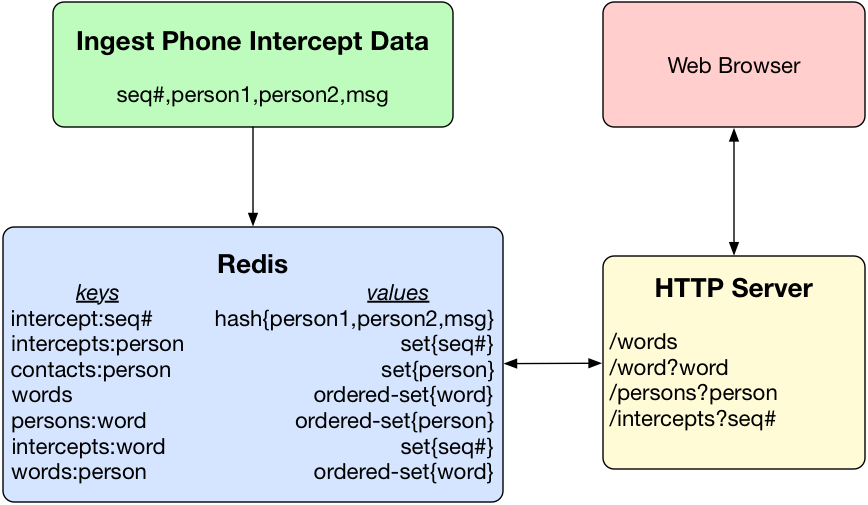

# CS 224 Assignment 7


## Phone Intercept Query System

This assignment will build on the httpd.c example program to create a web based interface for viewing phone intercept data. The data is stored on a Redis server. 

For each intercept ``<_seqnum_,_person1_,_person2_,_message_>`` the following Redis commands were executed to build the data store.

```
hmset intercept:_seqnum_ person1 _person1_ person2 _person2_ message _message_
sadd intercepts:_person1_ _seq_
sadd intercepts:_person2_ _seq_
sadd contacts:_person1_ _person2_
sadd contacts:_person2_ _person1_
 
for each _word_ in _message_
  zadd words 0 _word_
  zadd persons:_word_ 0 _person1_ 0 _person2_
  sadd intercepts:_word_ _seqnum_
  zadd words:_person1_ 0 _word_
```

Given this key/value store, information can be extracted from Redis using commands such as

```
hgetall intercept:400          gives the keys/values for intercept #400
smembers contacts:adams        gives the contacts of person adams
zrange persons:prisoners        gives people using the word prisoners
zrange words:adams              gives the words used by person adams

```

This repository contains inter-httpd.c which is the starting point for a program that will act as a web server providing access to the Redis store. Inter-httpd.c expands on the httpd.c example program. The main function opens and configures a socket for listening for httpd requests on port 8080. For each connection it forks a process to deal with the connection. The forked process runs handelClient() which inspects the request to make sure that it is a "GET" request and then checks that the path is one of 

```
/words                                 

         returns a page of all words in all intercepts with links to the 
         page for the word
         
/words?some-word                       

         returns a page giving all persons using the word (link to word 
         page) and all intercepts in which the word occurs (link to intercept 
         page)
         
/persons?some-person                   

         returns a page listing the contacts of the person (link to person 
         page), the words used by the person (link to word page), the intercepts 
         in which the person participates (link to intercept page)
         
/intercepts?some-intercept-number      

         returns a page listing the author and recipient of the intercept 
         (link to person page) and the text of the intercepted message with 
         each word linked to the page for the word
```

The implementation for the "/words" returnWordsPage() is provided. You need to implement returnWordPage(), returnPersonPage() and returnInterceptPage(). 

The onlly HTML formatting __required__ is the "\<h2>" tag, the "\<a href>" tag and the "\<br>" tag. ReturnWordsPage() gives examples of these.


 
## Getting and Building Hiredis
 
Once you have forked and cloned this respository, "cd" into the respository and execute ``git clone https://github.com/redis/hiredis.git``. This will give you a hiredis directory. "cd" into hiredis and execute ``make``. This will compile the library for static linking. "cd .." back out to your development directory and execute ``make inter-httpd``. This will compile and link the program. 

Run inter-httpd on your development machine and connect with a browser using the URL "http://127.0.0.1:8080/words".

 
## What To Do

- Fork this repository in GitLab
- Clone your fork to your development machine.
- Implement the assignment. 
- "make clean" and then "git add/commit/push" back to GitLab.
- Add me as a reporter member of your repository.
- Create an issue with me as the assignee. Use the issue title "Assign5 Ready for Grading"."
- In the issue make a note of your difficulty factor estimate for this assignment relative to the first assignment. 

