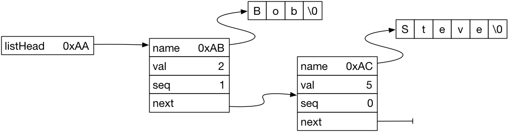

# CS 442 - Compiler Construction


This repository contains a two sample programs. The first is contained in files Sample.c, SampleAux.h and SampleAux.c. the second is contained in HighLight.c

## Sample

For this program SampleAux.h and SampleAux.c provide a singly linked list implementation. This implementation consists of a ``struct NameNode`` which has fields for ``name``, ``val``, ``seq`` and ``next`` and is used to construct the linked list. It also has a global variable ``listHead`` which points to the head node of the list. With two entries in the list the linked list looks like



The implementation provides the following functions.

* InitList() - initialize the ``listHead`` and ``listCnt`` variables.
* AddName(char * name, int val) - creates a ``struct NameNode`` to hold the name and value and inserts this node at the head of the list. 
* RemoveHead() - remove list head node.
* char * NameWithValue(int value) - returns the first name associated with the given value.
* DoForAll() - performs a supplied function on each name in the list.

The driver Sample.c uses this implementation. The driver 

* opens the input file for reading
* reads, using fscanf, names and values
* adds name and value to list
* keeps track of min/max values
* prints names for all values from min to max
* writes out the contents of the list

```
./Sample
Value   Name
    2   "Bob"
    3   "Sneezy"
    5   "Steve"
    7   "Ed"
    8   "Sally"
   11   "Sue"
   12   "Grumpy"
Seq  Val  Name
  5   12  "Grumpy"
  4    8  "Sally"
  3    7  "Ed"
  2   11  "Sue"
  1    2  "Bob"
  0    5  "Steve"
```

## HighLight

This program, contained in HighLight.c, reads its input searching for a string of characters supplied on the command line. It will print out all input lines that contain the string preceeded by a line of underscore characters to highlight the occurrences of the string. Sample output looks like

```
./HighLight all < HighLight_data
       ___
    1 Call me Ishmael. Some years ago- never mind how long precisely- having little or no money
                        ___
    7 I meet; and especially whenever my hypos get such an upper hand of me, that it requires a 
              ___
    9 methodically knocking people's hats off- then, I account it high time to get to sea as 
                                                           ___
   10 soon as I can. This is my substitute for pistol and ball. With a philosophical flourish 
                                                      ___
   12 surprising in this. If they but knew it, almost all men in their degree, some time or 
```

The program

* gets the search string from the command line through the argv variable
* allocates buffers for the line of input and the overbar line
* reads one line of input at a time using fgets()
* initializes the overbar line to all blanks
* tests for occurrences of the search string using strstr()
* where the string is found underscore characters are written into the overbar buffer
* if an occurrence was found the overbar line and the input line are written to the output

## D2E

This is an implementation from the Kernighan & Ritchie C Language book that takes as input C variables declarations and outputs English translations. The expected output is

```
translation: ap is a pointer to array of 10 char
```

This is included just to make sure that Flex/Bison are correctly installed in your development environment. We will look at how Flex/Bison work later in the semester. 
